# Streamline

[](https://github.com/datahearth/streamline/actions/workflows/ci.yaml)
[](https://github.com/datahearth/streamline/actions/workflows/image.yaml)
[](https://github.com/datahearth/streamline/releases/latest)
[](LICENSE)
[](go.mod)

Self-hosted unified media manager. Replaces the \*arr stack (Radarr, Sonarr, Lidarr, Readarr) and Seerr with a single binary.


|  |  |
| --- | --- |
| [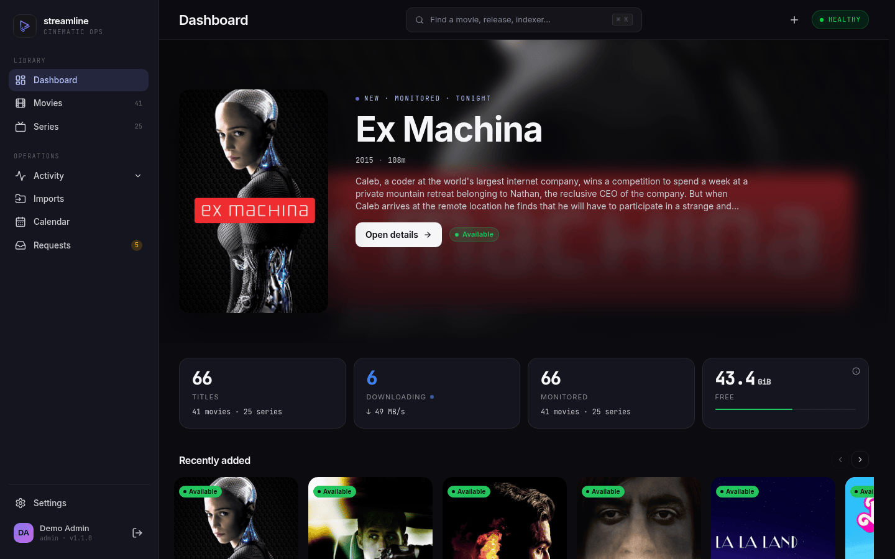](docs/assets/dashboard.png) | [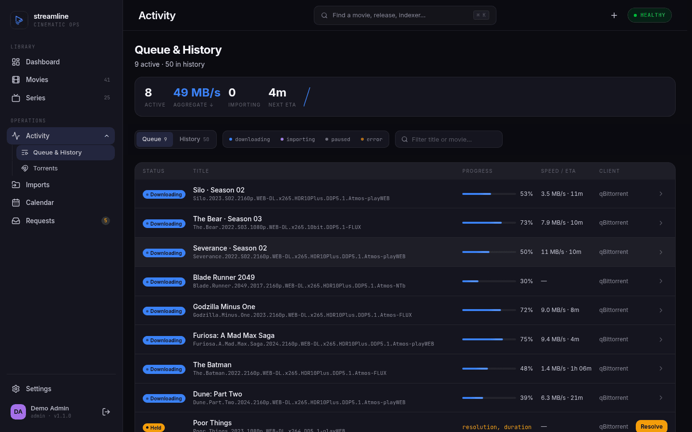](docs/assets/activity-queue.png) |
| **Dashboard** — the whole library at a glance | **Activity** — live progress, speed and ETA per download |

*[More screenshots](#screenshots) at the bottom.*

## Features

- Unified movie & TV library (music & books planned — see the [roadmap](docs/ROADMAP.md))
- Adopt an existing library: scan untracked files and import them under review
- Monitoring, RSS auto-grab, manual search, and a calendar of upcoming releases
- Quality profiles, activity queue and history
- Multi-user with SSO (OIDC), invites, API keys
- Built-in request system (Seerr replacement)
- Indexers: Torznab, Prowlarr
- Torrent download clients: qBittorrent, Transmission, Deluge
- Media server notifications and deep links: Plex, Jellyfin, Emby
- REST API (OpenAPI 3.0 spec)
- OpenTelemetry traces, metrics, logs
- GitOps-friendly: `read_only` config mode rejects runtime config writes
- CGO-free SQLite — single-binary, zero external deps

## Quick start (Docker Compose)

```yaml
services:
  streamline:
    image: ghcr.io/datahearth/streamline:latest
    restart: unless-stopped
    ports: ["8080:8080"]
    volumes:
      - ./data:/data
      - ./config:/etc/streamline:ro
      # Your media library, plus the finished-downloads dir your torrent client
      # writes to. Keep both on one filesystem: the default import mode is
      # `hardlink` (library.import_mode — `copy` and `move` also work).
      - /path/to/media:/media
      - /path/to/downloads:/downloads
```

```bash
mkdir -p config data
docker run --rm -v "$PWD/config:/etc/streamline" \
  ghcr.io/datahearth/streamline:latest config init --output /etc/streamline/config.yaml
docker compose up -d
```

Open http://localhost:8080.

### First login

An admin account is seeded on first boot. Set `auth.seed_admin.email` and `auth.seed_admin.password` (or `password_file`) in the config beforehand to choose the credentials.

If you don't, Streamline creates `admin@streamline.local` with a generated password and prints it **once**, to stdout, on a single line mentioning `default admin`. Capture it before anything else scrolls past:

```bash
docker logs streamline 2>&1 | grep 'default admin'                              # Docker
kubectl -n streamline logs deploy/streamline-streamline | grep 'default admin'  # Helm
```

Copy it right then and change it from Settings. It is never written to your config file and never passed to the log pipeline, so if you lose it the only way back is to wipe the data dir and re-seed — `auth.seed_admin` is applied against an empty database and ignored afterwards. Anything scraping container stdout captured it too, so treat it as compromised until you rotate it.

If you're upgrading from a release that saved those credentials into `auth.seed_admin.password`, Streamline no longer reads or rewrites that value once the admin exists. It's your file: delete the leftover plaintext yourself.

## Install

### Docker

Generate a config first (the `config init` step from the Quick start above), then:

```bash
docker run -d --name streamline \
  -p 8080:8080 \
  -v streamline-data:/data \
  -v "$PWD/config:/etc/streamline:ro" \
  -v /path/to/media:/media \
  -v /path/to/downloads:/downloads \
  ghcr.io/datahearth/streamline:latest
```

The media and downloads mounts are **required**, not optional extras: Streamline creates `library.movie_path` and `library.series_path` at startup and exits if it cannot. They default to `/media/movies` and `/media/series`, so dropping those two `-v` flags stops the container with `create library path /media/movies: mkdir /media: permission denied`. Point them wherever you like — just set `library.movie_path` / `library.series_path` / `library.download_path` to match. Keep media and downloads on one filesystem so the default `hardlink` import mode works (`library.import_mode` also accepts `copy` and `move`).

Tags: `latest`, `edge` (main branch), `vX.Y.Z`, `X.Y`, `X`, `sha-<short>`.

### Docker Compose

The Quick start snippet above is the deployment template. [deploy/compose.yaml](deploy/compose.yaml) is the project's *local test stack* — it builds the image from source and wires up gluetun (VPN), qBittorrent, Prowlarr and Plex against `tmp/`. Useful as a wiring reference, not as a starting point for your own deployment.

For a full observability stack (VictoriaMetrics + VictoriaLogs + VictoriaTraces + Grafana Alloy + Grafana), see [deploy/compose.observability.yaml](deploy/compose.observability.yaml). It is *development-only*: every port binds to `127.0.0.1`, because the Victoria\* backends serve unauthenticated write and admin APIs to anyone who can reach them. To use it from another machine, front it with an authenticated TLS reverse proxy or a VPN rather than widening the bindings.

### Helm

```bash
helm install streamline oci://ghcr.io/datahearth/charts/streamline \
  --namespace streamline --create-namespace
```

Pin a version with `--version X.Y.Z`; omit it to pull the latest release.

The chart is versioned independently of Streamline itself — a chart fix ships without an app release, and an app release ships without a chart bump. `--version` selects the *chart*; the app version it deploys is the chart's `appVersion` (override with `--set image.tag=X.Y.Z`). App releases are tagged `vX.Y.Z`, chart releases `chart-vX.Y.Z`.

### Binary (from GitHub releases)

Download from [Releases](https://github.com/datahearth/streamline/releases/latest). Binaries available for:

- Linux: amd64, arm64
- macOS: amd64, arm64
- Windows: amd64, arm64

```bash
# Linux amd64 example
curl -fsSL -o streamline.tar.gz \
  https://github.com/datahearth/streamline/releases/latest/download/streamline_<version>_linux_amd64.tar.gz
tar xzf streamline.tar.gz
cp config.example.yaml ~/.config/streamline/config.yaml
./streamline
```

Each archive includes a `config.example.yaml` with default values.

Verify checksum:

```bash
curl -fsSL -o checksums.txt https://github.com/datahearth/streamline/releases/latest/download/checksums.txt
sha256sum -c checksums.txt --ignore-missing
```

`checksums.txt` is itself signed with cosign (keyless, GitHub OIDC). Verify it before trusting the hashes:

```bash
curl -fsSL -o checksums.txt.bundle https://github.com/datahearth/streamline/releases/latest/download/checksums.txt.bundle
cosign verify-blob checksums.txt --bundle checksums.txt.bundle \
  --certificate-identity-regexp="https://github.com/datahearth/streamline/.github/workflows/release.yaml@.*" \
  --certificate-oidc-issuer=https://token.actions.githubusercontent.com
```

Each archive also ships an SPDX SBOM (`<archive>.sbom.spdx.json`).

### From source

Requires Go >= 1.26, Node >= 24, pnpm, [Task](https://taskfile.dev).

```bash
git clone https://github.com/datahearth/streamline.git
cd streamline
task
./streamline
```

## Configuration

Generate a default config:

```bash
streamline config init --output ~/.config/streamline/config.yaml
```

Every config key can also be set via environment variables with the `STREAMLINE_` prefix. A double underscore (`__`) is the path separator; a single underscore is literal, so keys with underscore segments stay reachable: `STREAMLINE_LOG__APP__LEVEL=debug` → `log.app.level`, `STREAMLINE_AUTH__SESSION_SECRET=…` → `auth.session_secret`, `STREAMLINE_OTEL__ENDPOINT=…` → `otel.endpoint`.

Validate a config file:

```bash
streamline config validate --config ~/.config/streamline/config.yaml
```

Login is rate-limited per client address: **5 attempts per 15 minutes**, counted
as a sliding window, so no fifteen minutes anywhere on the clock ever contains
more than five. Each attempt comes back to the budget exactly fifteen minutes
after it was made, and refusals carry a `Retry-After` saying when — always at
least one second. IPv6 clients are counted per `/64`, not per address: the
smallest block an ISP routes to one subscriber is a `/64`, so counting single
addresses would let one client step around its own throttle by picking the next
address out of its allocation. Everything sharing a `/64` therefore shares one
budget. IPv4 is counted per address.

Attempts are recorded per address and nothing is ever dropped to make room, so
no traffic from any number of addresses can hand a throttled client its attempts
back early, and nobody who has made no attempts is ever refused. Up to 262,144
addresses are tracked at once — about 41 MiB when full, which only a flood
approaches; an ordinary install holds one entry per client. Past that, an
address seen for the first time is allowed **without being counted** rather than
turned away.

That last sentence is the trade, so here is what it costs. 262,144 keys is a
routed IPv6 `/44`; a `/48` — what a tunnel broker or cheap VPS hands out — is
65,536 and stays fully metered, as does anything smaller. Measured at 20
attempts from each of a million addresses, the limiter granted 5.00 per address
up to the cap and 16.07 across the million, so an attacker who owns enough
addresses to fill the table can go unmetered from the ones beyond it. Reaching
that point means already holding 262,144 addresses that were each cut off at
five, and every account behind them still locks after
`auth.lockout.threshold` failed attempts. The table clears itself within thirty
minutes of the flood stopping, with no restart.

Clear a locked-out account:

```bash
streamline auth unlock user@example.com
```

### Single sign-on (OIDC)

Providers are configured under `auth.oidc[]`. How far Streamline trusts one is
two independent questions, and each has its own key: `email_linking` says which
existing accounts it may take over, `allow_admin` says whether it may hand out
the `admin` role. Both default closed.

`name` identifies the provider everywhere — in the callback URL, in the trust
lookup, in the discovered-verifier cache — so two entries may not share one.
Streamline refuses to start on a duplicate rather than let the entry that
validates a token differ from the entry whose `allow_admin` bounds it.

```yaml
auth:
  oidc:
    - name: keycloak
      issuer: https://sso.example.com/realms/main
      client_id: streamline
      client_secret_file: /run/secrets/oidc
      email_linking: disabled          # disabled (default) | non_admin | all
      allow_admin: false               # default — no login here yields admin
      role_claim: realm_access.roles   # dotted paths reach nested claims
      role_mapping:
        streamline-admins: admin
        streamline-users: member
```

**`email_linking` — which accounts it may adopt.** "Adopt" means a federated
identity the provider has never presented before signing in as an existing
account **because the email addresses match**. That is only safe where nobody
can choose their own address at the IdP: anywhere they can — an IdP with open
self-registration, or one that marks an unchecked address verified — a matching
email would otherwise mint a login for any local user, the seeded admin
included.

| `email_linking` | May adopt an existing account |
| --- | --- |
| `disabled` (default) | no |
| `non_admin` | non-admin accounts only |
| `all` | any account, `admin` included |

The setting gates the adoption, not what the adoption leaves behind. An
adoption links the federated identity to the account permanently, and every
later login matches on that identity without consulting `email_linking` at all
— so a provider back at `disabled` still signs in as each account it adopted
while it was open, local password and all. That is what makes the migration
procedure below work, and it is the same reason the pass has to be a short one:
Streamline has no unlink, so the only way to undo a binding is to delete the
user, which cascades the identity away with it.

**`allow_admin` — whether it may grant `admin`.** With it `false` (the default)
**no login through this provider ever puts an account on `admin`**, with no
exception: not a claim mapped to `admin` by `role_mapping`, not an
`auth.oidc_default_role` of `admin` a signup falls back to, and not the role
carried by an invite consumed through SSO. A user in both an admin group and a
member group lands on member; one in an admin group alone keeps whatever role
they already had. Set `allow_admin: true` for a provider that really is allowed
to decide who administers Streamline.

The two keys are deliberately separate. While one key meant both, tightening
the adoption tier could *raise* the role ceiling — an account of federated
origin, adopted while the provider was at `non_admin`, became promotable to
admin the moment the operator set that provider back to `disabled`. Splitting
them makes each axis monotone: no move on one can add capability on the other.

> [!IMPORTANT]
> **Upgrade impact.** Two defaults changed, both closing something earlier
> releases left open.
>
> *Adoption.* Earlier releases adopted a matching account unconditionally, and
> `email_linking` defaults to `disabled`. Any user whose local account was being
> reached that way — rather than by an identity already linked from a previous
> SSO login — starts failing at the login screen with *"this SSO account is not
> linked to a Streamline user"* (`oidc_link_not_allowed`). To bind those
> identities, open the provider up for one pass and close it again:
>
> 1. set `email_linking: non_admin` on the provider and restart;
> 2. have each affected user sign in through SSO once — that login links the
>    identity permanently;
> 3. set `email_linking: disabled` again and restart.
>
> Admin accounts are not covered by `non_admin`. Either move them during a
> maintenance window with `email_linking: all`, or leave them on password login.
> The pass does not touch roles: an adoption never writes one, `allow_admin`
> alone decides how high a role can go, and none of the three steps changes it.
>
> *Roles.* `allow_admin` defaults to `false`, so a provider whose `role_mapping`
> grants `admin` stops doing so until you set it. An existing admin whose claims
> map only to `admin` keeps the role — the barred mapping is dropped, not
> downgraded, so nothing is written. One whose claims *also* map to a lower role
> is demoted to it on the next login, that being the highest role the provider
> may now confer. Set `allow_admin: true` on the providers you want back in
> charge of admin.
>
> Nothing else changes for users who already signed in through SSO, or for
> password-only installs.

### Running behind a reverse proxy

`X-Forwarded-For` is believed only when the connecting peer is listed in
`server.trusted_proxies`. The list is empty by default, so out of the box the
TCP peer is always treated as the client:

```yaml
server:
  trusted_proxies:
    - 10.1.0.7/32     # the ingress
    - 10.1.0.8/32     # its standby
```

The chain is read right to left: entries that are themselves listed in
`server.trusted_proxies` are skipped and the first entry outside the list is the
client. Any number of proxy hops may be skipped, so a deep chain — CDN, WAF,
load balancer, ingress, sidecar — still resolves the real client. An entry that
cannot be parsed as an address aborts the walk, leaving the connecting proxy as
the client, and is warned about at most once a minute.

> [!WARNING]
> List the proxies themselves, as narrowly as you can — ideally one `/32` (or
> `/128`) per proxy. **Never a whole client subnet.** Naming a range that
> clients can also occupy — `10.0.0.0/8`, `192.168.0.0/16`, a Kubernetes pod or
> node CIDR — makes every host in that range a trusted proxy: any of them can
> then send `X-Forwarded-For` naming an address inside `auth.trusted_networks`
> and be handed the `auth.trusted_role` identity without authenticating. One
> forged entry is enough — there is no hop count or padding to get past.

**Upgrade impact.** `server.trusted_proxies` is new, and defaulting it to empty
changes behaviour for every install that already runs behind a reverse proxy —
previously the last `X-Forwarded-For` entry was trusted unconditionally. Until
you set it, every request is attributed to the proxy's own address:

- access logs and the IP shown on each session record read as the proxy;
- the login rate limit keys on the proxy, so **all** users behind it share one
  5-attempt / 15-min budget and lock each other out;
- `auth.mode: trusted-network` stops recognising LAN clients, because the
  address compared against `auth.trusted_networks` is now the proxy's.

Set `server.trusted_proxies` as part of the upgrade if a proxy sits in front.
Direct-to-binary installs need no change.

## Supported integrations

| Type             | Supported                            |
| ---------------- | ------------------------------------ |
| Indexers         | Torznab, Prowlarr                    |
| Download clients | qBittorrent, Transmission, Deluge    |
| Media servers    | Plex, Jellyfin, Emby                 |

## Verifying images

All images are signed with [cosign](https://github.com/sigstore/cosign) via GitHub OIDC (keyless). Verify:

```bash
cosign verify ghcr.io/datahearth/streamline:latest \
  --certificate-identity-regexp="https://github.com/datahearth/streamline/.github/workflows/image.yaml@.*" \
  --certificate-oidc-issuer=https://token.actions.githubusercontent.com
```

SBOMs are attached as cosign attestations. Fetch:

```bash
cosign download attestation ghcr.io/datahearth/streamline:latest \
  --predicate-type=https://spdx.dev/Document
```

Every image push is scanned by [grype](https://github.com/anchore/grype) for known vulnerabilities (severity >= high). Results are uploaded to the repository's [Security tab](https://github.com/datahearth/streamline/security/code-scanning).

## Contributing

Bug reports and PRs welcome — see [CONTRIBUTING.md](CONTRIBUTING.md) for setup,
the build/test loop, conventions and the policy on AI-assisted PRs. Participation
is governed by the [Code of Conduct](CODE_OF_CONDUCT.md).

Found a vulnerability? Don't open an issue — see [SECURITY.md](SECURITY.md).

## License

[GPL-3.0-or-later](LICENSE)

## Links

- Issues: https://github.com/datahearth/streamline/issues
- Releases: https://github.com/datahearth/streamline/releases
- Changelog: [CHANGELOG.md](CHANGELOG.md)
- Roadmap: [docs/ROADMAP.md](docs/ROADMAP.md)

## Screenshots

|  |  |
| --- | --- |
| [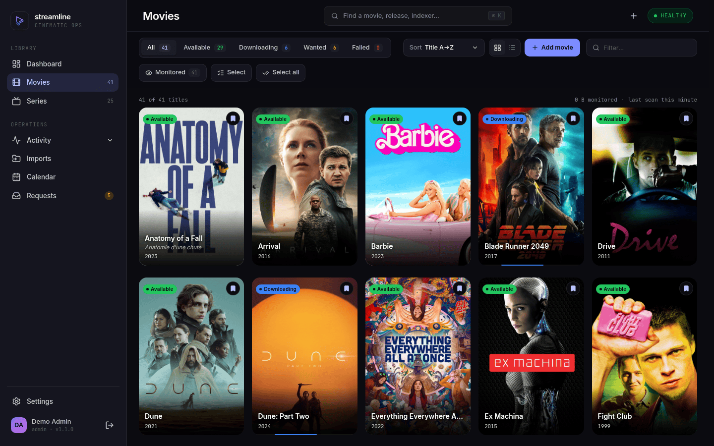](docs/assets/movies.png)<br>**Movies** — poster grid with per-title status | [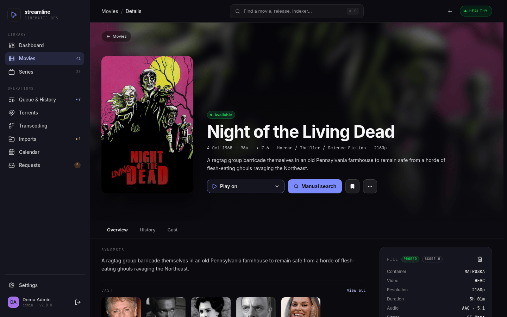](docs/assets/movie-detail.png)<br>**Movie detail** — cast, artwork, and ffprobe media info |
| [](docs/assets/series.png)<br>**Series** — every show, monitored and missing counts | [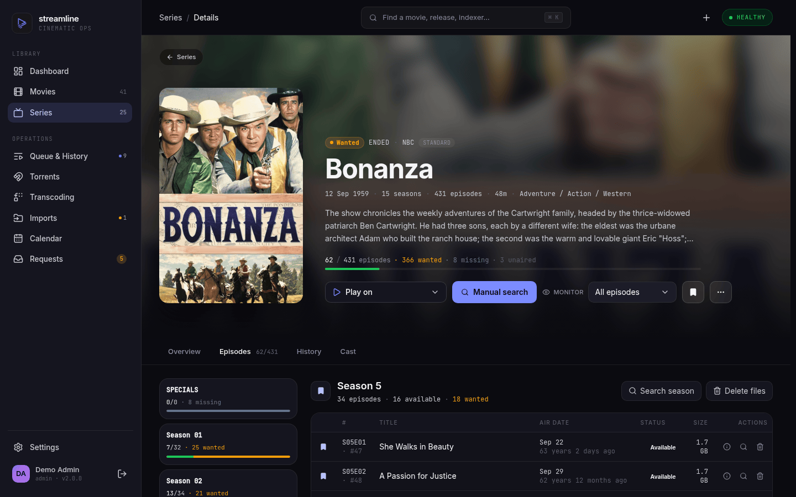](docs/assets/series-episodes.png)<br>**Episodes** — seasons, air dates, per-file quality |
| [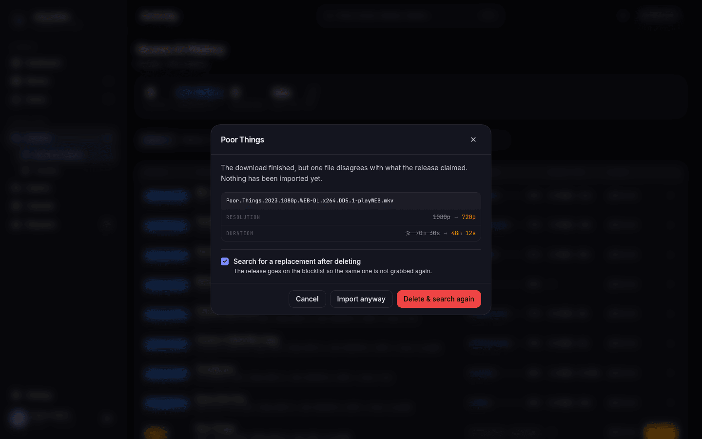](docs/assets/import-verification.png)<br>**Import verification** — a mismatched file is held, not imported | [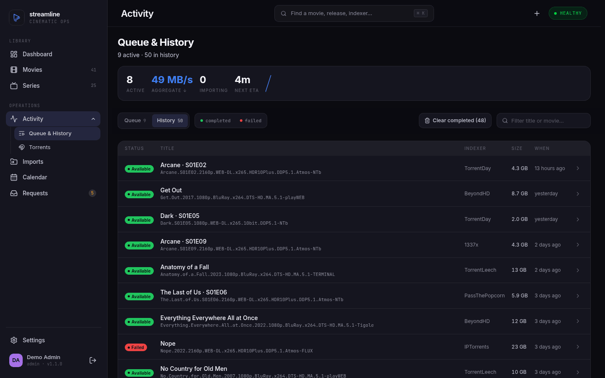](docs/assets/history.png)<br>**History** — every grab, where it came from, what it cost |
| [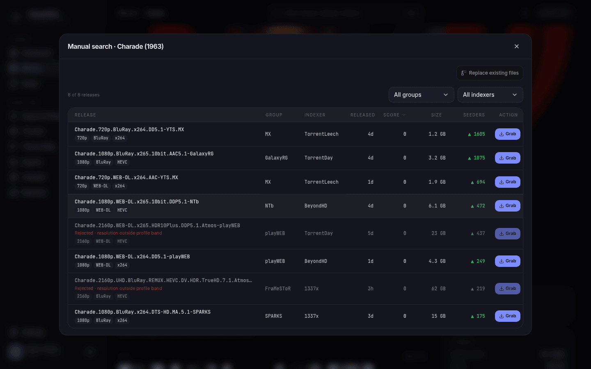](docs/assets/manual-search.png)<br>**Manual search** — every release from every indexer, one grab away | [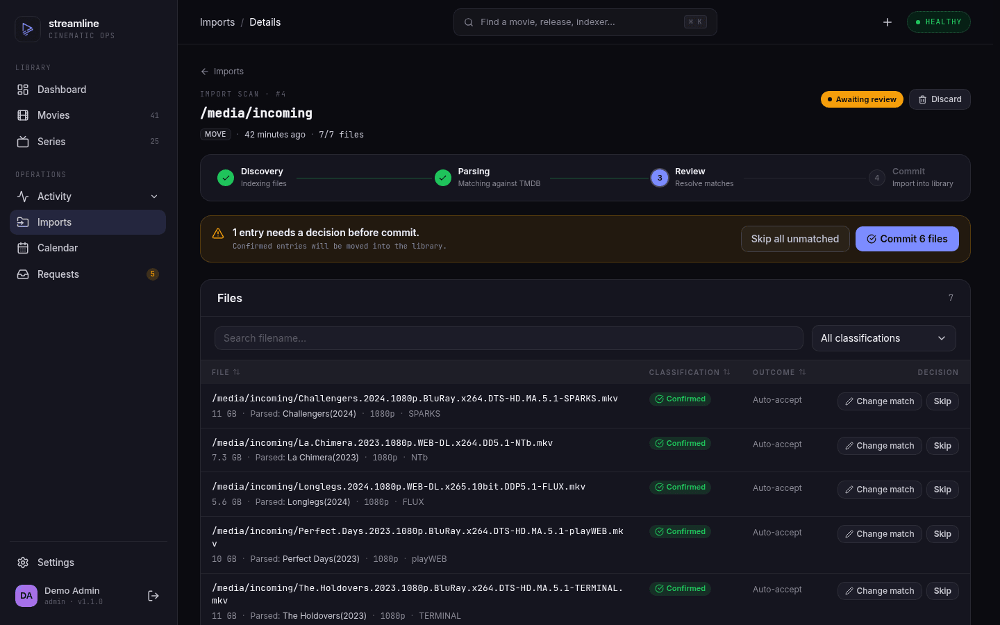](docs/assets/library-import.png)<br>**Library import** — adopt an existing library under review |
| [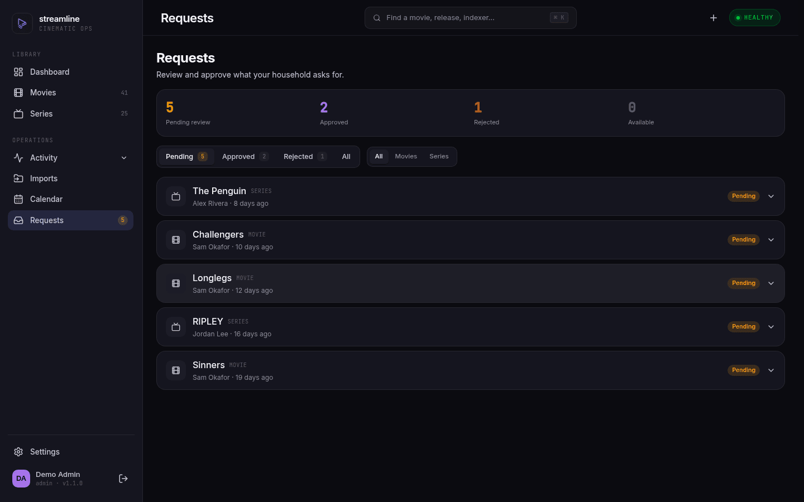](docs/assets/requests.png)<br>**Requests** — a built-in Seerr, no second service | [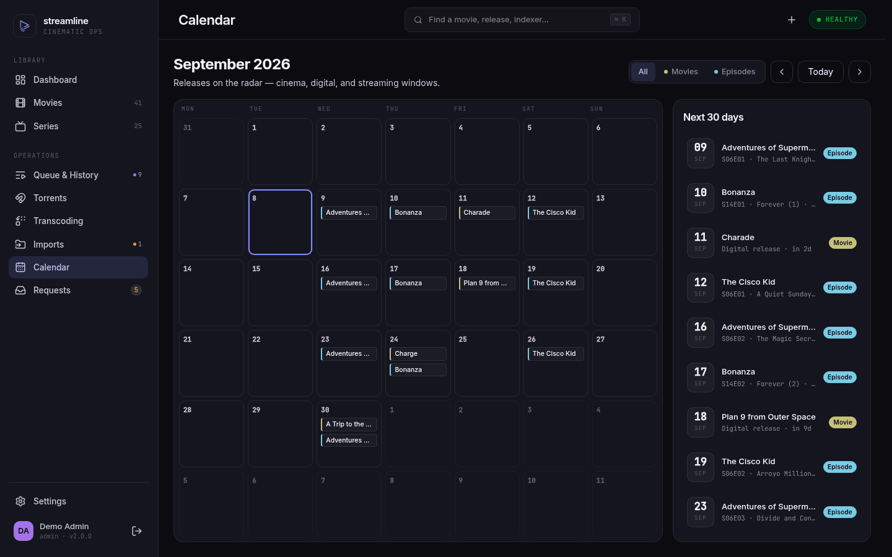](docs/assets/calendar.png)<br>**Calendar** — what lands this month |
| [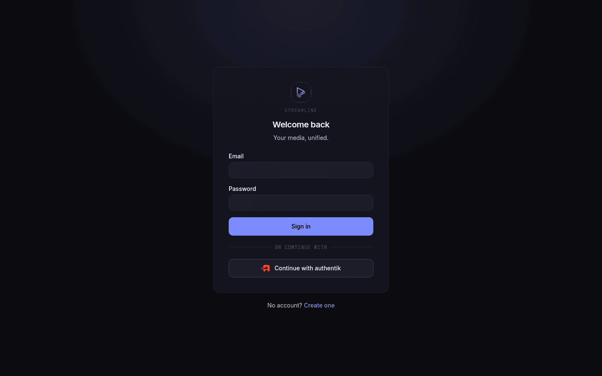](docs/assets/login.png)<br>**Sign in** — local accounts, or SSO through any OIDC provider | [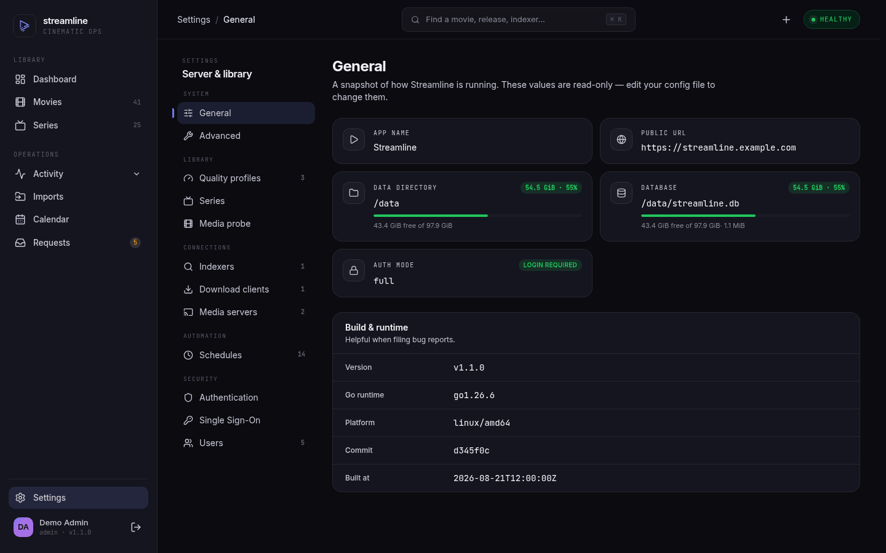](docs/assets/settings.png)<br>**Settings** — read-only runtime snapshot; the config file stays the source of truth |
