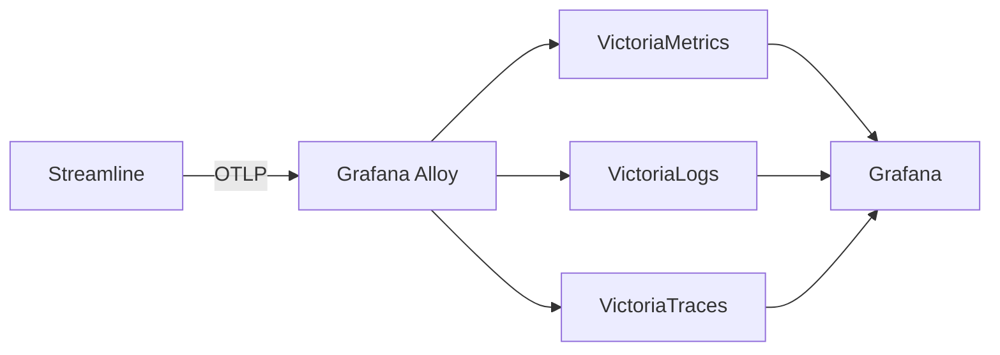

# Observability and Logging

Streamline emits structured logs, distributed traces and metrics. All three go over OTLP to a single endpoint; logs additionally go to stderr or a file.

- [Application logs](#application-logs)
- [HTTP access logs](#http-access-logs)
- [Automatic log context](#automatic-log-context)
- [OpenTelemetry](#opentelemetry)
- [A ready-made stack](#a-ready-made-stack)
- [What to alert on](#what-to-alert-on)

---

## Application logs

```yaml
log:
  app:
    enabled: true
    level: info        # debug | info | warn | error
    format: text       # text | json
    output: stderr     # stderr, an absolute path, or a path relative to data_dir
    rotate:
      max_size_mb: 100
      max_backups: 5
      max_age_days: 30
      compress: true
```

`text` is human-readable and right for `docker logs` or a terminal. `json` is right for anything that ships logs onward.

`rotate` only applies when `output` is a file path; rotating stderr is meaningless.

Beyond the four standard levels there's one more: **`CRITICAL`** (rendered as such, ranked above `error`). It's reserved for panics, invariant violations and unrecoverable conditions.

> [!TIP]
> A `CRITICAL` line is never routine — it's the one to page on.

---

## HTTP access logs

A separate logger with its own switch, so you can keep application logs at `debug` without drowning in request lines, or vice versa.

```yaml
log:
  http:
    enabled: true
    format: json       # json | combined
    output: stderr
    rotate: { ... }
```

`combined` approximates the Apache combined format with one deliberate deviation: **timestamps are RFC3339**, not Apache's `02/Jan/2006:15:04:05 -0700`. Log parsers expecting strict Apache format need adjusting.

The access logger is mounted as the outermost middleware, so it records every request — including 404s and panics.

---

## Automatic log context

Every log line made with a request context is enriched automatically. You don't configure this and you can't turn it off:

| Field | Source |
| --- | --- |
| `request_id` | chi's request ID middleware |
| `user.id`, `user.email`, `user.roles` | Auth claims, following OTel semantic conventions v1.40.0 |
| `http.route` | The chi route *pattern* — `/api/v1/movies/{id}`, not `/api/v1/movies/42` |
| `trace_id`, `span_id` | The active OTel span |

`http.route` carrying the pattern rather than the concrete path is what makes aggregation useful — you can group by route without high-cardinality explosion.

`trace_id` on every line is the important one: it links a log entry to the trace that produced it, so you can pivot from "this request errored" to the full span tree in one click.

---

## OpenTelemetry

```yaml
otel:
  endpoint: "alloy.observability.svc.cluster.local:4318"
  insecure: true
  sample_ratio: 0.05
  environment: "prod"
```

An empty endpoint disables OTel export entirely — no traces, no metrics, no log bridge. That's the default.

Traces, metrics and logs are all batch-exported to that single endpoint.

> [!IMPORTANT]
> The SDK defaults to HTTPS. For a plaintext collector set `otel.insecure: true` (the environment variable `OTEL_EXPORTER_OTLP_INSECURE=true` does the same). Forgetting this is the usual reason a correctly-configured endpoint receives nothing.

`otel.sample_ratio` is the head sampling rate for root spans, `0`–`1`, defaulting to `0.05`. The DB driver is instrumented, so `1.0` exports every SQL statement. Setting `OTEL_TRACES_SAMPLER` overrides it — Streamline stands aside and lets the SDK read the standard variables.

`otel.environment` fills `deployment.environment` on the resource. Two installs exporting to one collector are otherwise indistinguishable; the resource also carries host and OS attributes, and honours `OTEL_RESOURCE_ATTRIBUTES`.

> [!NOTE]
> `log.app.enabled: false` disables the **stderr sink only**. Traces, metrics and OTLP-exported logs continue as long as `otel.endpoint` is set. (Before v1.1 it disabled the whole pipeline.)

If the collector is unreachable, the export failure is logged to stderr as `opentelemetry export failed`, at most once a minute. Silence there means export is working — or that `log.app.enabled` is false.

### Traces

Every package has its own tracer, named `github.com/datahearth/streamline/internal/<pkg>`. Spans are named `<pkg>.<op>`:

```
download.grab
rss.process_movie
indexer.query
metadata.tmdb.search_movie
importer.import
```

Service methods add domain attributes to their spans, so a trace tells you *which* movie, *which* indexer, *which* client — not just that a grab happened.

Outbound HTTP is instrumented via a shared `otelhttp`-wrapped client, so calls to TMDB, TVDB, your indexers, your download clients and your media servers all appear as child spans with their own timings. When something is slow, the trace shows you whether it's Streamline or the thing it's talking to.

### Metrics

The database layer is auto-instrumented — SQL queries are traced via `otelsql`, and connection-pool statistics are registered as metrics. Go runtime metrics (goroutine count, GC pause, heap size) are exported too.

Beyond those, the series worth building alerts on:

| Metric | What it answers |
| --- | --- |
| `streamline.scheduler.job.last_success_unixtime` | "Has this background job stopped running?" A job that silently dies produces no errors to count — only a timestamp that stops advancing. |
| `streamline.download.client_reachable` | Whether each download client answered its last call. `0` for more than a few minutes means the client is down. |
| `streamline.bittorrent.stalled_torrents` | Incomplete torrents with no peers. |
| `streamline.transcoding.running` vs `.max_concurrent` | Saturated or stalled. Queue depth is `streamline_transcode_jobs_by_status{status="queued"}`. |
| `streamline.importer.outcomes` | Imports by `held` / `failed` / `terminal` / `succeeded`; `streamline.importer.queued` is the backlog. |
| `streamline.indexer.queries` / `.feeds` | Per-indexer outcome, split into `unauthorized`, `unreachable`, `bad_response` — an expired API key and a dead tracker are different problems. |
| `streamline.mediaserver.refreshes` | Per-server refresh outcome; catches Plex failing while Jellyfin works. |
| `streamline.auth.api_rejections` | Rejected `/api/v1` authentication by method and reason. |
| `streamline.auth.ratelimit.table_full` | **Any non-zero rate means the login rate limiter has stopped limiting.** |
| `streamline_requests_by_status{status="pending"}` | Request backlog. `streamline_movies_by_status` and `streamline_episodes_by_status` cover wanted/downloading counts. |

### Logs

The `otelslog` bridge sends application logs down the OTLP logs pipeline in addition to stderr/file. So with an endpoint configured, logs reach your collector already correlated to traces by ID, without a log shipper parsing text.

---

## A ready-made stack

The repository ships a working observability stack so you don't have to assemble one to try this.

**Docker Compose:**

```bash
docker compose -f deploy/compose.observability.yaml up -d
```



Point `otel.endpoint` at Alloy on `4318` and set `otel.insecure: true`.

**Kubernetes:** the Helm chart has an optional `observability` subchart wiring the same components from their upstream charts:

```yaml
observability:
  enabled: true
```

It installs into the `observability` namespace and auto-sets `otel.endpoint` to the in-cluster Alloy service. Two gotchas are already handled in the chart, but worth knowing if you're adapting it:

- **Cross-namespace DNS needs an FQDN.** `alloy:4318` won't resolve from the `streamline` namespace; `alloy.observability.svc.cluster.local:4318` will.
- **The VictoriaMetrics/Logs/Traces charts** (v0.35 / 0.12 / 0.0.7) have a selector/label mismatch — the selector uses `app: server` but templates drop it. The workaround is `server.podLabels.app: server` in each subchart's values.

---

## What to alert on

Reasonable starting points:

| Signal | Why |
| --- | --- |
| Any `CRITICAL` log line | Panic or invariant violation. Always real |
| `/health` non-200 | Process is up but unhealthy |
| Scheduled job `status: error` | Something broke; `last_error` says what |
| Scheduled job `status: skipped`, sustained | A precondition isn't met — usually no enabled download client, meaning nothing is being grabbed at all |
| Rising `last_duration_ms` on `drift-check` | Storage getting slow |
| Repeated 401/403 in access logs | Someone probing, or a broken integration with a revoked key |
| Disk usage on `data_dir` | SQLite has nowhere to grow |

Job state is exposed at `GET /api/v1/schedules` — an easy target for a scripted check even without a metrics stack:

```bash
curl -sS -H "X-API-Key: $KEY" $SL/api/v1/schedules \
  | jq -r '.items[] | select(.status=="error") | "\(.name): \(.last_error)"'
```

For a bare liveness probe, `/health` needs no authentication and is deliberately excluded from the OpenAPI spec so it can't drift into being treated as API surface.
