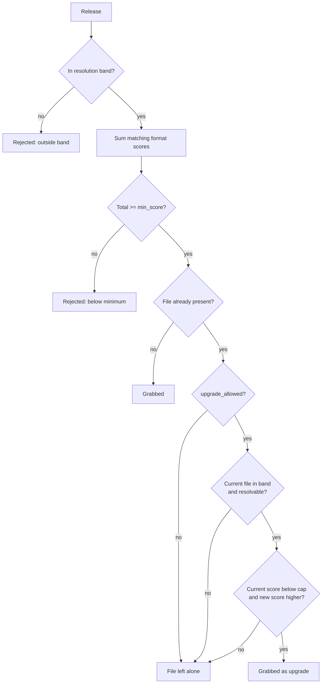

# Quality Profiles and Custom Formats

How Streamline scores a release against what you want, decides whether to grab it, and decides whether to replace a file you already have. For how a release title gets parsed into a resolution/source/codec/group in the first place, and how the resulting file gets named, see [Quality Profiles and Naming](Quality-Profiles-and-Naming).

## The decision path

Every release passes through the same gate. The band and score checks decide whether it is grabbed at all; the branch below them only runs when there's already a file on disk to compare it against.



- [The decision path](#the-decision-path)
- [Custom formats](#custom-formats)
- [The built-in library](#the-built-in-library)
- [Scoring profiles](#scoring-profiles)
- [The scoring mental model](#the-scoring-mental-model)
- [Upgrades](#upgrades)
- [Transcoding a profile's files](#transcoding-a-profiles-files)
- [The tester](#the-tester)
- [Presets](#presets)
- [Where scores show up](#where-scores-show-up)
- [Behavior changes from the old filter](#behavior-changes-from-the-old-filter)
- [Not in this phase](#not-in-this-phase)

---

## Custom formats

A custom format is a named set of conditions matched against a release (or, for on-disk files, a filename + probed technical data). It doesn't grab or reject anything by itself — a [quality profile](#scoring-profiles) attaches a score to it, and *that* score feeds the accept/reject/upgrade decision.

Config-backed like indexers and download clients: a top-level `custom_formats[]` list, name-keyed, hot-editable, no restart needed.

```yaml
custom_formats:
  - name: scene-junk
    description: Cam/telesync/screener rips
    conditions:
      - type: release_title
        pattern: '(?i)\b(cam(rip)?|hdcam|telesync|screener)\b'
        required: true

  - name: bad-group
    description: Groups I don't want
    conditions:
      - type: release_group
        pattern: '(?i)^(yify|yts|axxo)$'
        required: true
```

Both of these are *examples*, not defaults — nothing like them ships built in, deliberately (see [The built-in library](#the-built-in-library)). Score either one very negative in a profile and it becomes a blocklist. The release-group editor in **Settings → Custom formats** writes that second pattern for you: type group names as chips and it compiles the anchored alternation.

`description` is optional free text — it has no effect on matching, but shows on the format's row in **Settings → Custom formats** and as a hint wherever the format is scored in a quality profile, the same way a built-in's fixed description does.

| Condition type | Fields | Evaluated against |
| --- | --- | --- |
| `release_title` | `pattern` (regex) | The raw release title |
| `resolution` | `value` (`720p`\|`1080p`\|`2160p`) | Parsed resolution, or probed width for on-disk files |
| `source` | `value` | Parsed source (`BluRay`, `WEB-DL`, `WEBRip`, `HDTV`, `DVDRip`, `Remux`) — matched case-insensitively but not otherwise fuzzed, so it must equal the parser's normalized spelling. A bare `WEB` tag normalizes to `WEB-DL`, so write `WEB-DL` to catch both spellings; `WEBRip` stays distinct, since that one really is a re-encode |
| `release_group` | `pattern` (regex) | Parsed release group — the UI edits this one as a chip list, see below |
| `codec` | `value` | Parsed codec, or probed video codec for on-disk files |
| `size` | `min_gb` / `max_gb` | Indexer size, or the file's size on disk — **per episode**, see below |

<details>
<summary><b>4 more condition types</b> — seeders and the probe-only stream fields</summary>

| Condition type | Fields | Evaluated against |
| --- | --- | --- |
| `seeders` | `min` | Indexer seeders — always absent for an on-disk file, so this condition can never match a file |
| `audio_tracks` | `min` | Number of audio streams: probed for a file, inferred from a `MULTi`/`DUAL AUDIO` tag for a release |
| `audio_language` | `value` (ISO 639 code) | Audio stream languages: probed for a file, inferred from a `VFF`/`VFQ`/`TRUEFRENCH`/`VF2`/`VOF` tag for a release |
| `subtitle_language` | `value` (ISO 639 code) | Non-forced subtitle stream languages: probed for a file, inferred from a `VOSTFR`/`SUBFRENCH` tag for a release |

</details>

The last three are the only types besides the parsed columns that a file **already in your library** can answer, which matters more than it sounds — see [What a file can be scored on](#what-a-file-can-be-scored-on).

Language values are ISO 639 codes and are normalised on both ends, so `fre`, `fr` and `fra` are the same condition. Write whichever you like. Forced subtitle tracks are excluded from `subtitle_language`: a forced track carries signs and foreign dialogue rather than the script, so counting one would report a French dub as French-subtitled.

#### What the probe knows that you cannot match on

ffprobe records more than the conditions expose. These are stored and shown on the file/episode detail panels, but **no condition type reads them** — there is nothing to write against them today:

| Probed and shown | Matchable? |
| --- | --- |
| Width / height | ✅ via `resolution` (bucketed by **width**) |
| Video codec | ✅ via `codec` |
| Audio stream count | ✅ via `audio_tracks` |
| Audio / subtitle languages | ✅ via `audio_language` / `subtitle_language` |
| Container (`matroska`, `mp4`) | ❌ |
| Duration | ❌ — but it *is* checked at import, against `library.probe.min_duration_ratio` |
| Overall bitrate | ❌ |
| Audio codec (`eac3`, `dts`) | ❌ — only the *count* and the languages are matchable, not what the default track is encoded in |
| Audio channel count (5.1, 7.1) | ❌ |
| HDR / colour metadata | ❌ — not recorded at all. It is decidable for ~85% of files but only ~1–2% of releases advertise it, so a condition could almost never compare the two sides |

Write a `release_title` regex if you need one of these from the release side — just don't expect it to score the file you already have.


### Size is per episode, not per release

`min_gb` and `max_gb` are budgets **for one episode**. Streamline multiplies both by the number of episodes the release carries, so a single threshold means the same thing whether the release is one episode, a season pack, or a whole-series integral:

```yaml
# custom_formats[]
- name: oversized
  conditions:
    - { type: size, min_gb: 5, required: true }   # 5 GB *per episode*
```

| Release | Size | Episodes | Measured against | Matches `min_gb: 5` |
| --- | --- | --- | --- | --- |
| `Show.S03E01.1080p.WEB` | 1.4 GB | 1 | 5 GB | no |
| `Show.S03.1080p.WEB` (12 ep) | 17 GB | 12 | 60 GB | no |
| `Show.S03.1080p.BluRay.REMUX` (12 ep) | 155 GB | 12 | 60 GB | **yes** |
| `Show.COMPLETE.1080p.WEB` (60 ep) | 84 GB | 60 | 300 GB | no |

Score that format very negative (`-5000`) and the remux is rejected at every scope, while the ordinary season and series packs pass untouched. Without the scaling you would have to pick between a cap that lets the remux through and one that rejects every legitimate pack.

**Where the episode count comes from.** It is looked up in *your library*, per season, from the scope the release name claims — `S03` is season 3, `S01-S05` is those five seasons summed, `COMPLETE`/`INTEGRALE` is every season the show has. It is **not** the torrent's file count: no indexer reports that, and the torrent's contents are only knowable after grabbing it, which is too late to reject anything.

Two consequences worth knowing:

- **A season Streamline tracks no episodes for scales by nothing.** The bound is then applied to the whole release, exactly as it behaved before. Better a bound that is too generous than one invented from a count we don't have.
- **Movies always count 1**, so a `size` condition on a movie profile is unchanged by any of this.

The condition editor spells the arithmetic out as you type it — enter `1` and `5` and it tells you a 12-episode pack is judged against 12–60 GB. The format tester takes an **Episodes** field for the same reason: leave it at 1 to test a single file, set it to a season's length to see how a pack would score.

### Release groups without the regex

A `release_group` row in **Settings → Custom formats** is a chip list, not a text box: type a group name and press Enter (or type several separated by commas), click a chip's × to drop it. The editor compiles the chips to `(?i)^(name1|name2)$` — anchored, so `YTS` never matches `YTSAGAIN`, case-insensitive, and every name regex-escaped, so a group called `YTS.MX` matches that literal and not "YTS" plus any character. Score the format **negative to exclude** those groups and **positive to prefer** them; there is no separate blocklist, the arithmetic is the blocklist.

Nothing is hidden from you: **Edit as regex** switches the row back to the raw pattern, and an existing pattern the chip list could not have written (anything that is not exactly that anchored alternation of literals) opens as raw regex on its own, so a hand-written pattern is never silently rewritten. A raw pattern that *does* match the chip shape shows as chips again.

**Matching semantics are Radarr-compatible:** every `required` condition must pass, and if the format has any non-required conditions, at least one of those must also pass (a format that is all-required needs nothing else — "at least one of zero" is vacuously true). `negate` inverts a single condition's result before it's combined.

> [!IMPORTANT]
> A condition whose input was never recorded matches nothing — negated or not. This is the one place `negate` does *not* invert: "no" and "don't know" are different answers, and a negated condition reading a field nobody filled in would otherwise score a positive out of ignorance. The idiomatic "this release carries no group" format (`release_group`, pattern `.`, `negate: true`) is the case this exists for — it fires on a release whose name genuinely carries no group tag, and stays silent on a library file whose group was never stored.

The distinction only bites where a value can be *absent* rather than *stated as none*: a file already in the library, whose columns are filled at import and are empty on anything imported before those columns existed. A release parsed from its name knows everything the name says, so an empty group there is a real absence and matches as before. Seeders are always "unrecorded" for a file, and for a release whose indexer omitted the attribute.

Two required conditions is "AND". Two non-required conditions is "OR" (either matches the format). Mixing both is "these must all hold, plus at least one of these":

```yaml
conditions:
  - { type: release_title, pattern: '(?i)\bx265\b', required: false }
  - { type: codec, value: hevc, required: false }
```

matches a release that says "x265" in the title *or* one whose probed codec is `hevc` — the pattern the built-in `x265` format itself uses, so a probed file matches it even when the filename never says so.

---

## The built-in library

Ten formats compiled into the binary — not seeded into YAML, so they can't be half-edited and stay current across upgrades. They're always available to score in a profile, they're read-only through the API (`builtin: true`; `PUT`/`DELETE` against one is `409`), and a `custom_formats` entry may not reuse a built-in name (`config.Validate` rejects the collision).

| Name | Catches |
| --- | --- |
| `remux` | "remux" in the title |
| `x265` | x265/HEVC/h265 in the title, or probed codec `hevc` |
| `x264` | x264/AVC/h264 in the title, or probed codec `h264` |
| `resolution-2160p` / `-1080p` / `-720p` | Parsed resolution equals that exact tier |

<details>
<summary><b>4 more built-ins</b> — HDR, AV1, and the multi-audio/dubbed tags</summary>

| Name | Catches |
| --- | --- |
| `hdr` | HDR10/HDR10+/HDR/DV/Dolby Vision in the title |
| `av1` | "av1" in the title, or probed codec `av1` |
| `multi-audio` | "multi" or "dual audio" in the title |
| `dubbed` | "dubbed" in the title |

</details>

Every built-in *describes* a release — what codec, what resolution, what source. None of them judges one. Opinions about which release groups or which rip sources you'll accept are yours to write as `custom_formats`, because they don't generalize: the group list one person blocks is the group list another prefers, and a screener is worthless to most people and the only available copy to some. The `scene-junk` and `bad-group` examples above, and the release-group chips in **Settings → Custom formats**, are there to make writing your own a two-minute job.

`GET /api/v1/custom-formats` returns both libraries in one list; check `builtin` to tell them apart.

---

## Scoring profiles

Four fields were added to the existing profile shape; everything that was there before still means what it meant before:

```yaml
quality_profiles:
  - name: default
    min_resolution: 1080p         # unchanged: hard floor
    preferred_resolution: 2160p   # now the hard CEILING of the accepted band
    upgrade_allowed: true         # unchanged: master switch for replacing files
    allowed_codecs: []            # unchanged: drives import holds only, not grab decisions
    formats:                      # NEW: score per format, by name
      - { name: x265, score: 100 }
      - { name: hdr, score: 50 }
      - { name: scene-junk, score: -1000 }   # a custom_formats entry of your own
    min_score: 0                  # NEW: total below this -> release rejected
    upgrade_until_score: 500      # NEW: stop upgrading once the current file reaches this

quality_default_profile: default
```

| Incoming release | Formats matched | Score | Outcome under `default` |
| --- | --- | --- | --- |
| `Movie.2024.2160p.BluRay.x265.mkv` | `x265` (+100) | 100 | Above `min_score` (0) — grabbed if nothing better is on disk |
| `Movie.2024.2160p.BluRay.x265.HDR.mkv` | `x265` (+100), `hdr` (+50) | 150 | Above `min_score`, and higher-scoring — wins if both are candidates for the same item |
| `Movie.2024.CAM.mkv` (also scored against `scene-junk`) | `scene-junk` (−1000) | −1000 | Below `min_score` (0) — rejected |

`formats[].name` must resolve to a built-in name or a `custom_formats` entry — an unknown name is a `422` on save. A profile with no `formats` at all still works: nothing is scored, so any in-band release passes with a score of `0`.

**`preferred_resolution` changed meaning.** It used to be the exact target when upgrades were off. It's now the ceiling of the accepted `min_resolution`..`preferred_resolution` band — resolution *preference* inside that band is expressed by scoring the built-in `resolution-*` formats instead. A release outside the band (too low, or above `preferred_resolution`) is rejected before any format is even evaluated.

Because it is the ceiling, a `min_resolution` *above* `preferred_resolution` describes an empty band that rejects every release. Config validation refuses it outright rather than letting the profile look configured while grabbing nothing.

---

## The scoring mental model

For one release against one profile:

1. **Band check.** Resolution below `min_resolution` or above `preferred_resolution` → rejected, reason "resolution outside profile band". No score is computed.
2. **Sum.** Add the profile's score for every format that matches. Formats the profile doesn't list contribute nothing. Overlapping formats stack — `x265` (100) + `hdr` (50) scores 150, by design; every surface that shows a score also shows which formats matched, so the arithmetic is visible.
3. **Minimum check.** Total below `min_score` → rejected, reason "score below profile minimum".

Two idioms fall out of this:

- **"Never grab this"** is a very negative score (`-1000`) on a custom format like the `scene-junk` example above, combined with `min_score: 0` — there's no separate blocklist feature, the arithmetic *is* the blocklist.
- **`upgrade_until_score` is "the score I'd be happy to stop at"**, not a target to aim for. `0` means no cap — any strictly higher-scoring release keeps upgrading. A cap nothing can reach just means upgrades never turn off for that profile; see [Upgrades](#upgrades).

**Selection**, among the releases that pass both checks: highest total score wins. Ties are broken by seeders.

Scores are relative order *within one profile* — there is no global scale, and comparing a score of 150 under one profile against a score of 150 under another means nothing.

---

## Upgrades

A profile can replace a file already on disk with a better release, but it never happens because you searched by hand — an interactive grab either fills a `wanted` item or overwrites because you ticked replace, and the upgrade rules aren't consulted either way. Two automatic paths apply them: the **RSS feed scanner**, which grades every release the feed shows it against what's on disk, and the **missing-episode search**, which upgrades only as a side effect of a season pack it was already grabbing to fill that season's gaps (see [Series, seasons and episodes](#series-seasons-and-episodes)). Neither ever runs a search *in order to* upgrade.

Whichever path found the release, the grading is the same. For a monitored movie or episode that already has a file (`upgrade_allowed` on, nothing already in flight for it — an item mid-re-grab isn't re-grabbed again every tick), the incoming release is graded against the current file:

1. The release must pass the profile's band + minimum checks like any other candidate.
2. **The current file's resolution must be in-band** (`Profile.UpgradableFrom`) — at or below `preferred_resolution`, and not unresolvable. A file *above* the band, or one whose resolution can't be determined at all, is never touched: both cases score `0` for the same mechanical reason (the band rejected them before any format was summed), and `0` is not evidence the file is bad — it's evidence the file is untouchable. Replacing it would delete exactly what the profile was protecting.
3. **The current file's score must be below `upgrade_until_score`** (or the cap is `0`, meaning no cap), and the new release's score must be strictly higher.

Only then does Streamline grab the replacement, mark the new download record's replace mode `upgrades`, and let the existing import-verification/replace flow do the rest — the same path a manual "replace" grab uses. No new download states, no separate upgrade queue.

### Series, seasons and episodes

Episodes upgrade by the same three rules, but a season pack is judged **episode by episode** against each episode's own file, not against the season as a whole:

- **Each episode in the pack is compared to its own file.** A release that beats episode 3 but not episode 7 replaces episode 3 and leaves episode 7 alone — there's no season-wide veto, so one strong episode no longer blocks a pack that would improve the rest. At least one episode has to qualify for the pack to be grabbed at all.
- **Filling a gap and upgrading happen in the same grab.** If a pack covers episodes you're missing, it's grabbed to fill them, and any episode you already have that the release beats is replaced in that same download — you don't need to re-run it once the season is complete. Both automatic paths work this way: the feed scanner when a pack turns up in the RSS listing, and the missing-episode search when it goes hunting for a season that still has gaps. The missing search only reaches for a pack when **two or more** of a season's episodes are due to be searched this pass — missing, aired, monitored, past their cooldown and under the grab-failure ceiling. A season with three gaps where two are unaired or still cooling down takes the single-episode path instead, and a single-episode grab replaces nothing; a season with no gap at all is never searched, so no pack is ever grabbed purely to upgrade.
A single-episode release is judged against that one episode alone.

Series upgrades reuse the identical import path: verification runs before anything on disk is touched, scoped to the episodes the import actually plans to replace (see [Import verification](Configuration-Reference#import-verification)) — a season pack doesn't verify episodes it isn't going to touch. That per-episode plan, and the probe re-check behind it, is a season-pack thing: a single-episode release was already judged once by the scanner, and the importer's import just carries that decision through.

**On-disk scores are never stored.** Every comparison rebuilds a `ReleaseContext` from the file's row on demand — basename parsed the same way a release title is, resolution from the probed width (falling back to the filename parse), codec from the probe, size from the row. Editing a profile re-ranks your whole library instantly, with no migration and no cached score to invalidate.

---

## Transcoding a profile's files

Scoring decides which release you *grab*. A profile can also decide what the file looks like once it's on disk: a `transcode` block re-encodes or remuxes imported files that don't comply with it.

This is off unless you turn it on globally — `transcoding.enabled` in [config](Configuration-Reference#transcoding), or Settings → Transcoding. A profile with no `transcode` block is never touched either way.

```yaml
quality_profiles:
  - name: default
    min_resolution: 1080p
    preferred_resolution: 2160p
    transcode:
      if:                            # a file failing ANY of these is queued
        video_codecs: [hevc, av1]    # h264 gets re-encoded
        containers: [mkv]            # anything else gets remuxed to mkv
        max_video_bitrate: 12M       # above this, re-encode even if the codec is fine
        min_video_bitrate: 2M        # below this, leave the codec alone
      to:
        container: mkv
        video_codec: hevc
        crf: 22                      # lower is bigger and better; 18–28 is the usual range
        preset: medium
        audio_codec: aac
        audio_passthrough: [truehd, eac3, dts]   # optional; see below
```

**`if` is the compliance test, `to` is the destination.** Each new import on this profile is probed, checked against `if`, and queued when it fails. Files that were already in the library when you wrote the rules aren't reached automatically — **Scan library** on [Activity → Transcoding](Activity-and-Calendar#transcoding) is the pass that catches them up.

**Failing only the container is a remux, not a re-encode.** The streams are copied into the new container untouched: seconds instead of hours, and no quality lost. Only a codec or bitrate failure re-encodes.

**`min_video_bitrate` leaves lean sources alone.** A source below it skips the codec rule — the ceiling and the container rule still apply, so it is still remuxed if it's in the wrong container. Re-encoding at a constant quality doesn't look at the source's bitrate, so a small h264 file usually comes back *larger* than it went in; the floor is how you tell Streamline not to bother. It reads the same figure as the ceiling, which on mkv is the container's total, so leave it headroom as well. It has to be below `max_video_bitrate` when you set both, or the config is refused.

**HDR and Dolby Vision are never re-encoded.** The codec and bitrate rules are suspended for them, so a 60 Mbit/s HDR remux stays exactly as it is even under `max_video_bitrate: 12M`. Re-encoding HDR without carrying its metadata through produces grey, washed-out video, and that's worse than a large file. The container rule still applies — an HDR file in the wrong container is remuxed, which is lossless anyway.

**`audio_passthrough` keeps lossless and object-based audio intact.** Listed source codecs are copied instead of being re-encoded to `to.audio_codec`, per track. The default when you name none is `truehd eac3 ac3 dts aac opus flac`: TrueHD and E-AC-3 carry Atmos, and DTS-HD can't survive a re-encode losslessly, so copying is the only way they come out the other side. Set it explicitly to a shorter list if you'd rather trade that for the space.

**The swap is atomic and verified.** The encode is written beside the original, probed to confirm the duration matches and the audio survived, and only then renamed over the file — so an interrupted or failed transcode never leaves you with a broken library file. A container change moves the file to the new extension and the old one is deleted; the database row follows it. `size_before` is kept, which is what the detail page's "35 GB → 12 GB" line reads.

**A file's [`media_info`](REST-API#media-probe) is rewritten by the transcode, not cleared.** The encode is probed to verify it before the swap, and that probe is what the row keeps — so the file's codec, bitrate and track counts describe the new bytes immediately. Nothing has to wait for the media-probe backfill, and nothing scores the file off the release name it was originally imported under.

**`to.container: mp4` drops subtitle and attachment streams; `mkv` keeps everything.** mp4 cannot carry SRT, ASS or PGS subtitles, nor font attachments, so only video and audio are copied across. If your files carry subtitles you want to keep, target mkv.

> [!IMPORTANT]
> The destination has to satisfy `if`, or the config is refused. A `to.video_codec` your own `if.video_codecs` rejects — or a `to.container` your `if.containers` rejects — would re-encode every file, then read the result as non-compliant and re-encode it again, forever, with every job reporting success. Streamline refuses that at startup. The variant it cannot predict is a `crf` that produces a file above `max_video_bitrate`: set the ceiling above the rate you are aiming for, not at it.

**Don't score file size and transcode on the same profile.** A `size` condition scored positively for `min_gb` says "bigger is better"; a transcode makes files smaller and re-probes them. Together, every transcode makes its own output look like something worth upgrading.

**Scan library skips files this pipeline already produced.** A row with a transcode behind it is left alone — re-encoding an encode loses quality for nothing.

Failed jobs retry up to `transcoding.max_failures` times and then park in the queue with ffmpeg's own error, for you to look at. Nothing is deleted on failure — the original file is still there.

**Hardware encoding.** On Linux the encode can run on an Intel or AMD GPU through VAAPI: `transcoding.hw_accel` (default `auto`) probes `transcoding.hw_device` once and uses it whenever the policy's `to.video_codec` has a VAAPI encoder, falling back to the CPU for that job otherwise. `crf` is handed to the GPU as a constant QP and `preset` maps onto its compression level, so a policy needs no rewriting to move between the two. Hardware encoders are fast but routinely produce a larger file than x265 at the same quality, which is what the `transcoding.verify` size band and VMAF check are for. It needs an ffmpeg built with VAAPI, and the default Docker image does not have one: see [Hardware encoding](Installation#hardware-encoding-vaapi) for the `-vaapi` image and the device passthrough, and [Configuration Reference](Configuration-Reference#transcoding) for the two keys.

**Transcoding and seeding.** When you import with `library.import_mode: hardlink`, the library file and the torrent's copy share one inode. A transcode renames the encode over the library path only, so the torrent keeps seeding from the original — but from then on the original and the encode each take their own space on disk for as long as the torrent's copy stays. To hold that cost off while it still buys you something, turn on `transcoding.defer_seeding` (Settings → Transcoding). A deferred job asks the download client about its torrent every hour and runs as soon as the torrent is no longer downloading or seeding there — stopped at its ratio, paused, or removed. Files Streamline did not download itself (a bulk import, a retroactive scan) have no torrent to wait on and encode right away, and so does a file whose download record has aged out of the activity history. **Caveat:** the flag waits for seeding to end, not for the torrent's copy to be deleted; a torrent that stopped seeding but was kept with its files still costs the second copy until you remove it.

**Not supported:** VideoToolbox on macOS and NVENC/QSV/AMF (VAAPI is the only hardware backend), a Dolby-Vision-preserving re-encode, and editing `transcode` from the profile form in the UI — this block is YAML and API only. There is also no way to *remove* a policy over the API: omitting the field on an update keeps the stored one, so clearing it is a config-file edit.

---

## The tester

`POST /api/v1/custom-formats/test` evaluates a **draft** set of conditions — saved or not — against a synthetic sample, and reports pass/fail per condition plus the format's overall match. It's how the create/edit form in **Settings → Custom formats** lets you check a pattern before committing it.

```bash
curl -X POST -H "X-API-Key: $KEY" -H 'Content-Type: application/json' \
  -d '{
    "conditions": [
      { "type": "release_title", "pattern": "(?i)\\bremux\\b", "required": true }
    ],
    "sample": { "title": "Movie.Title.2024.2160p.UHD.BluRay.REMUX.mkv", "size": 45000000000, "seeders": 40 }
  }' \
  https://streamline.example.com/api/v1/custom-formats/test
```

```json
{ "matched": true, "conditions": [{ "index": 0, "passed": true }] }
```

An empty `conditions` array is `422`. A condition that does not compile — an uncompilable regex, an unknown `type`, a resolution outside the three buckets — is `422` with `code: invalid_condition`, and the same code comes back from creating or updating a format. Its `message` names the offending condition ("condition 0: error parsing regexp: …") and the UI shows it verbatim, so it is the only place the regexp diagnostic appears.

---

## Presets

The new-profile dialog offers three starting points — SPA-side templates, no server involved, prefilling the *whole* form (name, both resolutions, allowed codecs, scores and thresholds) so you edit from there:

| Preset | Name | Resolution band | Allowed codecs | Formats | `min_score` | `upgrade_until_score` |
| --- | --- | --- | --- | --- | --- | --- |
| **Quality first** | `Quality first` | 1080p – 2160p | any | remux +200, hdr +100 | 0 | 300 |
| **Space saver** | `Space saver` | 720p – 1080p | HEVC, AV1 | x265 +100, av1 +80, remux −100 | 0 | 100 |
| **x265 only** | `x265 only` | 720p – 1080p | HEVC | x265 +100, x264 −1000 | 0 | 100 |

Applying one never saves — it fills the form and you edit from there, including the name it suggests. Every format name in a preset is a built-in, so a preset applies cleanly to a fresh install with no `custom_formats` defined yet; that is also why no preset carries a group blocklist or a junk-source penalty, which would have to name a format only you can write.

---

## Where scores show up

[](https://raw.githubusercontent.com/DataHearth/streamline/main/docs/assets/manual-search.png)

- **Browse releases** (`/movies/{id}/search`, the series browse endpoints, and the RSS/missing-search paths that feed them) sort by score descending, ties by seeders — not by seeders alone. Every `SearchResult` carries `score`, `rejected`, `reject_reason`, and `matched_formats`, all relative to the queried item's own profile. Rejected releases are still listed (the SPA mutes them) — an operator can grab one deliberately; `score`/`rejected`/etc. are ignored if present on a grab request body.
- **Movie detail** (`GET /movies/{id}`) reports `file_score` on each entry of `media_files` — the file's score against the movie's current profile, computed at response time. It's list-response-omitted (the same eager-loaded `media_files` edge that also carries file size and quality elsewhere), and absent entirely when no quality profile is configured at all. There's no `rejected` flag on a file — a file outside the band or below `min_score` simply shows `file_score: 0`, the same number the upgrade decision reads.
- **Series detail** (`GET /series/{id}`) reports `file_score` on each episode that has a file, against the series' profile, on the same terms. The series *list* never carries episodes at all, so there is no list/detail split to think about there.
- `min_score` is omitted from API responses when it's `0` — the handler only sets the pointer when the value is non-zero, not a signal that the profile has no minimum. Absent means `0`.

### What a file can be scored on

A file in the library is scored from the columns the importer stored — its release group, the source/resolution/codec parsed from the release name at import, and (once probed) its audio track count, audio languages and subtitle languages — with the probe winning wherever it has an answer. It is **not** scored by re-parsing its path: the renamer wrote that path from your naming template, and the default template keeps only the resolution, so the group and source are gone from it.

The exception is `release_title`. It matches the whole raw release name, and a file in your library no longer has one — so against a file this condition is treated as **unanswerable**, not as a miss.

That distinction is the whole game. A format written *only* as a title regex cannot judge a file, so streamline drops it from **both** sides when deciding an upgrade, rather than letting the release score it and the file not. Before this, a profile whose weight sat in title-matched formats read its entire library as upgradable, forever: on one real install an anime profile paying `vostfr` +1000 left every episode about 1050 points below its own `upgrade_until_score`, and no file could ever earn those points back.

**The fix, and what you should do about it:** pair a title regex with a condition the file can answer, in the same format, both non-required. The format then matches a release by its name and a file by its probe, and the two become comparable:

```yaml
custom_formats:
  - name: vostfr
    conditions:
      - { type: release_title, pattern: '(?i)\bvostfr\b' }
      - { type: subtitle_language, value: fra }
  - name: vff
    conditions:
      - { type: release_title, pattern: '(?i)\b(truefrench|vff|vf2|vof)\b' }
      - { type: audio_language, value: fra }
```

| Match against | `vostfr` fires on | `vff` fires on |
| --- | --- | --- |
| A release title | `vostfr` in the name | `truefrench`/`vff`/`vf2`/`vof` in the name |
| A library file | French (`fra`) subtitle track present | French (`fra`) audio track present |

Either half is enough to match — the two conditions are non-required, so the format scores a release by its name and a file already on disk by its probe, and the two become comparable.

The builtin `multi-audio` already ships this way (`MULTi` in the title **or** two audio tracks on disk), as do `x265`/`x264`/`av1` (title **or** probed codec).

Some things stay unanswerable for a file no matter what, because they are facts about the *upload* rather than about the bytes:

- **`vff` vs `vfq`** — both are `tags.language: fra` in the file. The pairing above will match either. If you score `vfq` negatively, that release never gets grabbed in the first place, so in practice the French audio on your disk is the one you wanted.
- **`remux`**, **`repack`/`proper`**, and screener/junk-source tags — nothing in the file records them.

Two consequences remain for those:

- A `file_score` is a floor, not the score the release originally earned. A REMUX on disk under a profile scoring `remux` at +250 reports 250 less than the release it came from.
- Those formats take no part in upgrade decisions at all — neither for nor against.

Probing has to be on for any of this: with `ffmpeg.enabled: false` the stream conditions are unanswerable too, and upgrades fall back to comparing only the parsed columns. Files imported before this feature are filled in by the `media-probe` backfill job (25 rows every 15 minutes), so an existing library converges on its own.

---

## Behavior changes from the old filter

Three, all a consequence of moving from "first release that passes" to score-then-select — worth knowing if you're tuning an install that predates this feature:

1. **`pickBest` is now score-ranked, then seeders-ranked** — previously it was first-hit (whichever the indexer listed first). A profile with an empty `formats` list still improves: it becomes seeders-ranked instead of first-hit.
2. **A profile with `upgrade_allowed: false` and `min_resolution` below `preferred_resolution` can now grab anywhere in that band.** Before, "upgrades off" meant "accept only exactly `preferred_resolution`". Now it means "accept the whole band, just don't replace a file already there."
3. **`preferred_resolution` is a hard ceiling, everywhere a profile is evaluated** — including the RSS/missing-search feed scanners, not just interactive search. An install whose `preferred_resolution` sits below its media's actual resolution will stop grabbing anything above it until the profile is raised.

> [!WARNING]
> If your library already has files above a profile's `preferred_resolution`, review your profiles before relying on automatic search after upgrading — the ceiling now applies everywhere, so grabbing above it silently stops until the profile is raised.

---

## Not in this phase

- **No active backlog search for upgrade-eligible items.** Upgrades happen when the RSS feed happens to see a better release, or when the missing-episode search grabs a season pack that also beats what you have — and that second one only reaches seasons with gaps, since a complete season is never searched. Nothing goes looking for an upgrade on its own after you retune a profile. Re-run search manually on items you want re-evaluated right away.
- **No per-file score caching.** Every score above is computed on the fly; that's fine at today's cost, but means there's no SQL-queryable "show me everything below its upgrade cap" view yet.
- **No community format import/sync** (TRaSH Guides, Dictionarry, etc.). Custom formats here are entirely local.
